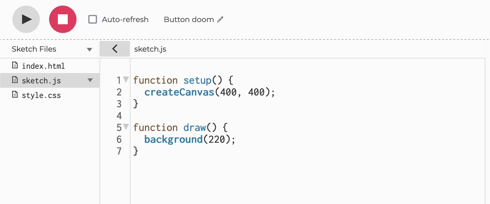

# Communication with physical space and our phones


As we start building our final projects, a popular immersive technique is combining the 'real world' with some digital content on a guest's smartphone. 

We can elegantly prompt a phone interaction with different real life triggers. We'll be quickly overviewing how to do this with: QR codes, Image markers, NFC (near field communication) tags.

We will start with using p5 and the editor, but eventually extract the concepts from p5 and locally code. 

The most challenging aspect of this will be hosting your code for guests to access on their phones. 

## p5 editor

Launch the [p5 Editor](https://editor.p5js.org/).

Basic p5 code:

```
let x = 50;
let y = 100;

function setup() {
  createCanvas(400, 400);
}

function draw() {
  background(220);
  circle(x, y, 20);
}
```

Now let's look at an example of using a QR code with the p5 editor, made by Tom Igoe. The JavaScript documentation is [here](https://github.com/kazuhikoarase/qrcode-generator/tree/master/js).

```
/*
  QR Code generator

  Draws a QR code using a text string.  Uses 
  https://github.com/kazuhikoarase/qrcode-generator
  as the QR Code generator library. It's hosted at this CDN:
  https://unpkg.com/qrcode-generator@1.4.4/qrcode.js"

  created 19 July 2020
  by Tom Igoe
*/

// a string to diisplay in the QR code
// (the URL of this sketch):
let inputString = parent.location.href;
// an HTML div to display it in:
let tagDiv;

function setup() {
  createCanvas(windowWidth, windowHeight);
  // make the HTML tag div:
  tagDiv = createDiv();
  // position it:
  tagDiv.position(30, 30);
  console.log(inputString);
}

function draw() {
  background(255);
  fill(0);
  text(inputString, 10, 10);

  // make the QR code:
  let qr = qrcode(0, 'L');
  qr.addData(inputString);
  qr.make();
  // create an image from it:
  // paaramtetrs are cell size, margin size, and alt tag
  // cell size default: 2
  // margin zize defaault: 4 * cell size
  let qrImg = qr.createImgTag(5, 20, "qr code");
  // put the image into the HTML div:
  tagDiv.html(qrImg);
}
```


Now you an easily just print off the created QR code, and use it in your physical project. We likely won't just load an external website though, we'll want to direct guests to some content we've created. Creating your own website would be better for this, but an easy way to do it that doesn't delve into server side programming is using p5. 

Let's put [this](https://vimeo.com/253989945) video in a standard p5 sketch. The iFrame embed we'll use is this: 

```
<div style="padding:56.25% 0 0 0;position:relative;"><iframe src="https://player.vimeo.com/video/253989945?h=c6db007fe5&color=ef0800&title=0&byline=0&portrait=0" style="position:absolute;top:0;left:0;width:100%;height:100%;" frameborder="0" allow="autoplay; fullscreen; picture-in-picture" allowfullscreen></iframe></div><script src="https://player.vimeo.com/api/player.js"></script>
```

YouTube works as well, the positioning just needs to be finetuned a bit more to make it responsive. 

If you've never noticed, in the p5 sketch, there's an arrow beside 'sketch.js' text where we can access the html and css. 



So we just drop the above iFrame into the html. Also we can minimize (or even delete) the JavaScript sketch. 

We save this sketch, note the URL, and now use that url in the QR code sketch for the variable 'inputString'. 

So this is for playing a video that's hosted elsewhere, which would be the recommended method for videos because they're large (and p5 probably has a file size max). You can easily do the same thing with images that are already hoste online. If they are not, you can upload files from the same tab as when you find the html and css files. 


Click on the arrow beside 'Sketch Files'


And click upload file. 


From there, we can draw the image on to our sketch.

```
let puppy;

function preload() {
  puppy = loadImage('puppy.jpg');
}

function setup() {
  createCanvas(400, 400);
  
}

function draw() {
  background(220);
  image(puppy, 0, 0);
  noLoop();
}
```

Now you have many options! If you need to create a multi-page website, that could get difficult with p5 sketches. 


## AR.js

Augmented reality is getting easier to incorporate on the web. (AR.js)[https://ar-js-org.github.io/AR.js-Docs/] is a pretty simple way to start making augmented reality work on the web. 

Image tracking could be utilized in our projects, but I'm not going to cover that now. What we're going to look at is marker tracking, specifically 'patterns', which are more interesting than boring QR codes, Hiros, and barcodes. 

We'll need to import the Marker tracking library:
`<script src="https://raw.githack.com/AR-js-org/AR.js/master/aframe/build/aframe-ar.js">`

And the three.js library, which AR.js utilizes:
`<script src="https://raw.githack.com/AR-js-org/AR.js/master/three.js/build/ar.js">`


## NFC

NFC (Near Field Communiction) is built on RFID technology. It's the technology we use when we pay for something with our phone, bank cards, etc. 

There is new experimental Google Chrome technology to let your phone read NFC tags. The stipulations:
- Newer Android phone
- Only through Chrome

Unfortunately, I don't have working devices to test it. But if someone does, they can see if it works here:
https://googlechrome.github.io/samples/web-nfc/

Usually our phones work the other way, utilizing a 'tag' in the phone itself, and using readers. This approach wouldn't work for our experiences though, without some heavy engineering. The order would have to go something like:
- Guest launches website for your project
- Scans RFID scanner, connected to Arduino, connected to the web
- RFID scanner communicates to a server
- Server communicates to the website that the guest is on, and triggers something to happen

This would take a long time to demo, so this will be a specialty case. 


## Experiments

[Image Tracking]('./image-tracking.html)